# 👋 Wassup guys, I'm Subhashish

 

<i>Curious mind. Continuous learner. Always building.</i>

---

## 👨‍💻 ABOUT ME

I'm a Computer Science Engineering student passionate about software
development, DevOps, AI, and building practical projects.

Currently exploring the intersection of software development,
automation, artificial intelligence, and deployment.

---

## 🛠️ TECHNOLOGY MATRIX

### 💻 Languages

<table align="center">
<tr>

<td align="center" width="100">
 
<b>C</b>
</td>

<td align="center" width="100">
 
<b>Java</b>
</td>

<td align="center" width="100">
 
<b>Python</b>
</td>

<td align="center" width="100">
 
<b>SQL</b>
</td>

<td align="center" width="100">
 
<b>HTML</b>
</td>

<td align="center" width="100">
 
<b>CSS</b>
</td>

<td align="center" width="120">
 
<b>JavaScript</b>
</td>

</tr>
</table>

### ⚙️ Development & Tools

<table align="center">
<tr>

<td align="center" width="110">
 
<b>Git</b>
</td>

<td align="center" width="110">
 
<b>GitHub</b>
</td>

<td align="center" width="110">
 
<b>VS Code</b>
</td>

</tr>
</table>

### ☁️ DevOps

<table align="center">
<tr>

<td align="center" width="120">
 
<b>Docker</b>
</td>

<td align="center" width="120">
 
<b>Jenkins</b>
</td>

<td align="center" width="140">
 
<b>GitHub Actions</b>
</td>

</tr>
</table>

### 🤖 AI & Data

<table align="center">
<tr>

<td align="center" width="120">
🧠 
<b>NLP</b>
</td>

</tr>
</table>

<i>Building • Learning • Deploying • Improving</i>

---

## 🌌 CONTRIBUTION UNIVERSE

---

## 🏆 GITHUB ACHIEVEMENTS

---

## 🚀 FEATURED PROJECTS

### 🤖 AI-Driven Chatbot as a Virtual Assistant

An AI-powered virtual assistant built to provide intelligent conversational interactions using the Google Gemini API, with a focus on deployment and DevOps practices.

**Tech:** Python • Gemini API • SQLite • Docker • Docker Compose • Jenkins • GitHub Actions • Prometheus • Grafana

[🔗 View Project](https://github.com/subhashishbudati9976-creator/AI-Driven-Chatbot-as-a-Virtual-Assistant)

---

### 🚆 Railway Reservation System

A collaborative software project implementing railway search, reservation, cancellation, payment and administrative workflows with database-backed CRUD operations.

**Tech:** HTML • CSS • JavaScript • Node.js • Express.js • PostgreSQL • Supabase

---

### 🛰️ ODA-CMS

A collaborative academic project focused on orbital data processing, simulation and visualization, including 3D visualization and collision-risk analysis.

**Tech:** React • FastAPI • PostgreSQL • WebGL • Python

---

---

## 🌐 CONNECT WITH ME

<a href="www.linkedin.com/in/subhashish-budati-685664427" target="_blank">
 
Subhashish Budati

</a>

&nbsp;&nbsp;

<a href="https://github.com/subhashishbudati9976-creator" target="_blank">
 
subhashishbudati9976-creator

</a>

<i>Let's connect, collaborate, and build something meaningful.</i>

