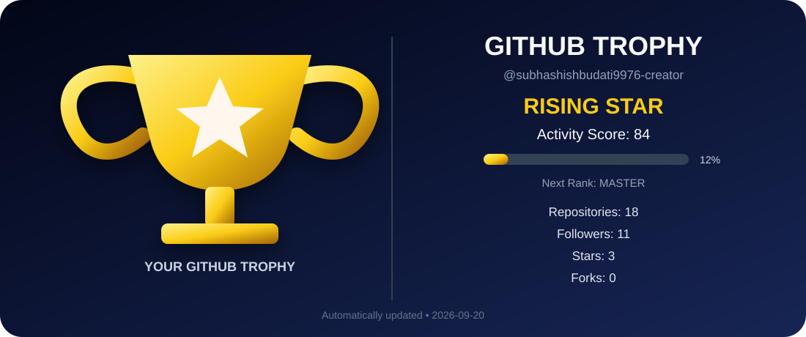

  

  

# HEY AMIGOS, welcome aboard — grab a coffee ☕ and check out what I'm building

 

`CSE • AI • NLP • DEVOPS • SOFTWARE DEVELOPMENT`

 

<i>Curious mind. Continuous learner. Always building.</i>

 

`━━━━━━━━━━━━━━━━━━━━━━━━━━━━━━━━━━━━━━━━`

## 👨‍💻 ABOUT ME

I'm Subhashish Budati, a Computer Science Engineering student who enjoys turning ideas
into practical projects and learning how the systems behind them work.

I'm currently exploring **AI, NLP, DevOps, automation, and software development**,
while strengthening my foundations in **DSA, databases, and programming**.

 

💡 Build → 🧪 Experiment → 🔧 Debug → 🚀 Deploy → 📚 Learn

---

## 🛠️ TECHNOLOGY MATRIX

### 💻 LANGUAGES

 

### ⚙️ DEVELOPMENT & TOOLS

 

### ☁️ DEVOPS

 

### 🤖 AI & DATA

🧠 <b>NLP</b>

<i>Learning the tools. Understanding the systems. Building the projects.</i>

---

## 🧭 CURRENTLY EXPLORING

### 🤖 AI & NLP
Exploring practical AI-powered applications and NLP.

### ⚙️ DEVOPS
Learning CI/CD, Docker, Jenkins and GitHub Actions.

### ☁️ CLOUD & DEPLOYMENT
Understanding modern deployment and automation workflows.

### 💻 SOFTWARE DEVELOPMENT
Strengthening DSA, programming and problem-solving.

### 🗄️ DATABASES
Building and working with SQL-based applications.

 

`LEARN` → `BUILD` → `EXPERIMENT` → `IMPROVE`

---

## 🚀 FEATURED PROJECTS

### 🤖 AI-DRIVEN CHATBOT AS A VIRTUAL ASSISTANT

An AI-powered virtual assistant designed for intelligent conversational
interaction using the Google Gemini API, with a focus on deployment
and DevOps practices.

<code>Python</code> • <code>Gemini API</code> • <code>SQLite</code> •
<code>Docker</code> • <code>Jenkins</code> • <code>GitHub Actions</code>

<a href="https://github.com/subhashishbudati9976-creator/AI-Driven-Chatbot-as-a-Virtual-Assistant">
🔗 <b>VIEW PROJECT</b>
</a>

 

### 🚆 RAILWAY RESERVATION SYSTEM

A collaborative database-backed application implementing railway search,
reservation, cancellation, payment and administrative workflows.

<code>HTML</code> • <code>CSS</code> • <code>JavaScript</code> •
<code>PostgreSQL</code> • <code>Supabase</code>

🔗 <b>COLLABORATIVE ACADEMIC PROJECT</b>

 

### 🛰️ ODA-CMS

A collaborative academic project focused on orbital data processing,
simulation and visualization, including 3D visualization and
collision-risk analysis.

<code>React</code> • <code>Python</code> • <code>FastAPI</code> •
<code>PostgreSQL</code> • <code>WebGL</code>

🔗 <b>COLLABORATIVE ACADEMIC PROJECT</b>

 

### 🧪 MORE PROJECTS

Currently experimenting with new projects across software development,
AI, NLP and DevOps.

🚧 <i>More coming soon...</i>

---

## 🌌 CONTRIBUTION UNIVERSE

 

<i>Every contribution is a step forward.</i>

 

---

## 🏆 GitHub Trophy

  

---

## 🌐 CONNECT WITH ME

<a href="https://www.linkedin.com/in/subhashish-budati-685664427" target="_blank">
 
<b>LinkedIn</b>
</a>

&nbsp;&nbsp;&nbsp;&nbsp;&nbsp;&nbsp;

<a href="https://github.com/subhashishbudati9976-creator" target="_blank">
 
<b>GitHub</b>
</a>

  

<i>Let's connect, collaborate, and build something meaningful.</i>

---

 

### 🚀 Thanks for visiting my profile!

<i>Building • Learning • Deploying • Improving</i>

 

`━━━━━━━━━━━━━━━━━━━━━━━━━━━━━━━━━━━━━━━━`

