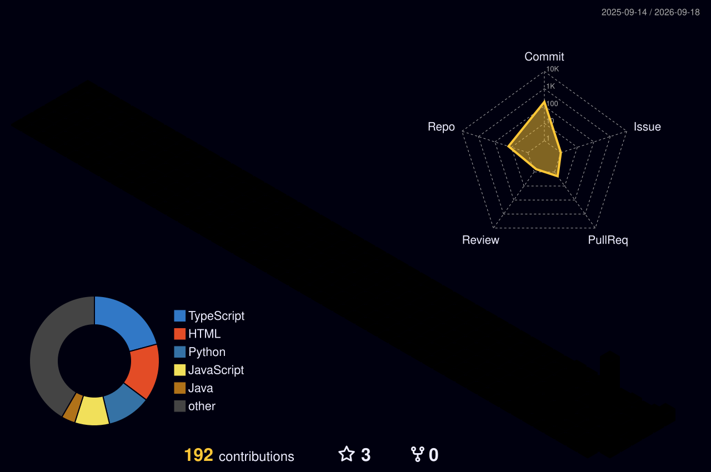

# 👋 Wassup guys, I'm Subhashish

 

<i>Curious mind. Continuous learner. Always building.</i>

---

## 👨‍💻 ABOUT ME

I'm a Computer Science Engineering student passionate about software
development, DevOps, AI, and building practical projects.

Currently exploring the intersection of software development,
automation, artificial intelligence, and deployment.

---

## 🛠️ TECHNOLOGY MATRIX

### 💻 Languages

<table align="center">
<tr>

<td align="center" width="100">
 
<b>C</b>
</td>

<td align="center" width="100">
 
<b>Java</b>
</td>

<td align="center" width="100">
 
<b>Python</b>
</td>

<td align="center" width="100">
 
<b>SQL</b>
</td>

<td align="center" width="100">
 
<b>HTML</b>
</td>

<td align="center" width="100">
 
<b>CSS</b>
</td>

<td align="center" width="120">
 
<b>JavaScript</b>
</td>

</tr>
</table>

### ⚙️ Development & Tools

<table align="center">
<tr>

<td align="center" width="110">
 
<b>Git</b>
</td>

<td align="center" width="110">
 
<b>GitHub</b>
</td>

<td align="center" width="110">
 
<b>VS Code</b>
</td>

</tr>
</table>

### ☁️ DevOps

<table align="center">
<tr>

<td align="center" width="120">
 
<b>Docker</b>
</td>

<td align="center" width="120">
 
<b>Jenkins</b>
</td>

<td align="center" width="140">
 
<b>GitHub Actions</b>
</td>

</tr>
</table>

### 🤖 AI & Data

<table align="center">
<tr>

<td align="center" width="120">
🧠 
<b>NLP</b>
</td>

</tr>
</table>

<i>Building • Learning • Deploying • Improving</i>

---

## 🌌 CONTRIBUTION UNIVERSE

---

## 🏆 GITHUB ACHIEVEMENTS

---

---

## 🚀 FEATURED PROJECTS

### 🤖 AI-Driven Chatbot as a Virtual Assistant
AI-powered virtual assistant deployed using modern DevOps practices.

**Technologies:** Docker • Jenkins • GitHub Actions • Nginx • Gemini API • Prometheus • Grafana

### 🚆 Railway Reservation System
A railway reservation system developed as a collaborative software project.

### 🏢 ODA CMS
A collaborative content management system project.

---

