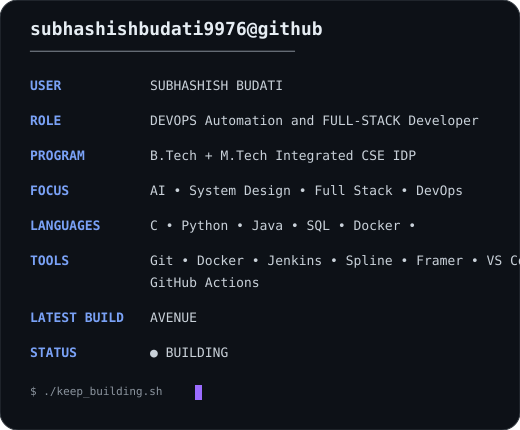
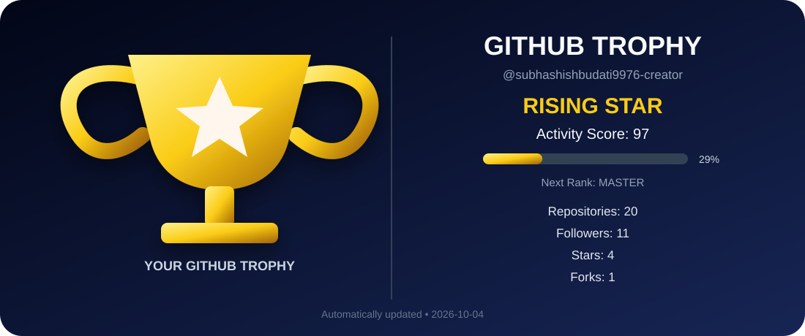

<div align="center">



<br><br>

<h3>
<code>subhashish@github ~ $ thisiswhoiam</code>
</h3>



<br><br>

<table>
<tr>

<td valign="top">

</td>

<td valign="top">

</td>

</tr>
</table>

<br>

<code>CSE • AI • NLP • DEVOPS • SOFTWARE DEVELOPMENT</code>

<br>


</div>

---

## 👨‍💻 ABOUT ME

I'm **Subhashish Budati**, a Computer Science Engineering student interested in building practical software systems and understanding the engineering behind them.

Currently exploring **AI, NLP, DevOps, automation and software development**, while strengthening my foundations in **DSA, databases and programming**.

```text
BUILD → EXPERIMENT → DEBUG → DEPLOY → LEARN
```
--- 

 ## 🛠️ TECHNOLOGY MATRIX

<div align="center">

💻 LANGUAGES


⚙️ DEVELOPMENT


🚀 DEVOPS


🤖 AI / DATA
NLP • Data Analysis
</div>
 
 --- 

## 🚀 FEATURED PROJECTS
🏦 AVENUE
Intelligent Branch Service Load & Customer Experience Optimizer
A data-driven platform designed to analyze branch workload, detect service bottlenecks and support operational decision-making.
Focus areas
- Demand forecasting
- Bottleneck detection
- Wait-time estimation
- Staff recommendations
- Simulation
- Customer feedback analysis
Python Data Analysis Machine Learning FastAPI React Docker
View Project
🤖 AI-DRIVEN CHATBOT
AI-Powered Virtual Assistant
A containerized conversational AI application integrating the Gemini API with a database-backed backend and DevOps automation.
Python Gemini API SQLite Docker Jenkins GitHub Actions
View Project
🛰️ ODA-CMS
Orbital Data Processing & Visualization
A collaborative academic project focused on orbital data processing, simulation, visualization and collision-risk analysis.
Python React FastAPI PostgreSQL WebGL
🚆 RAILWAY RESERVATION SYSTEM
A collaborative database-backed application implementing railway search, reservation, cancellation, payment and administrative workflows.
HTML CSS JavaScript PostgreSQL Supabase
🌌 GITHUB ACTIVITY
<div align="center">


<i>Every contribution is a step forward.</i>
</div>

---

## 🏆 GITHUB TROPHY

<div align="center">



</div>

--- 

## 🌐 CONNECT WITH ME
<div align="center">

<a href="https://www.linkedin.com/in/subhashish-budati-685664427">


<b>LinkedIn</b>
</a>

      
<a href="https://github.com/subhashishbudati9976-creator">


<b>GitHub</b>
</a>


<i>Let's connect, collaborate, and build something meaningful.</i>
</div>

<div align="center">

<code>Building • Learning • Deploying • Improving</code>
</div>
```